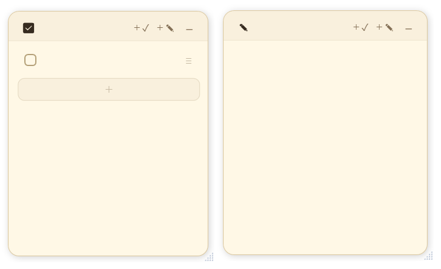
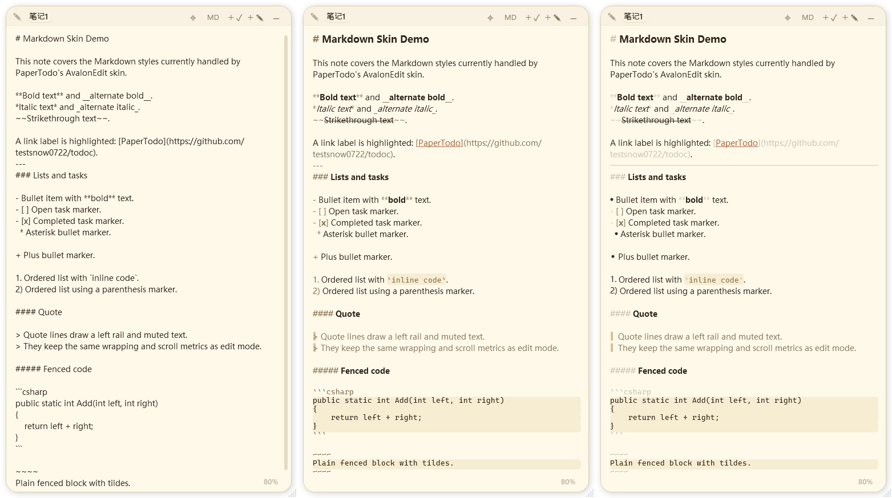

<div align="center">

# PaperTodo · 一张纸

**让桌面上有几张安静、可用、不打扰人的纸。**

一个极简的 Windows 桌面便签工具，只用 WPF 原生实现，没有主窗口、没有账号、没有管理器。

   

</div>

---

## 预览

| 桌面纸片 | 深色模式 |
| :---: | :---: |
|  |  |
| 多张独立纸片停留在桌面上，待办和笔记各自保存位置、尺寸与状态。 | 保持纸片质感，降低夜间桌面的视觉刺激。 |

**Markdown 浏览** — 笔记纸支持编辑 / 浏览双模式，浏览态保留轻量排版并弱化标记干扰；下图是「不启用 / 启用 / 增强」三档解析的对比。



| 胶囊模式 | 胶囊自动贴边 |
| :---: | :---: |
|  |  |
| 纸片可折叠为小胶囊，减少桌面占用。 | 折叠胶囊自动贴到屏幕右侧，悬浮时滑出。 |

---

## 设计理念

- **纸片优先** — 每张纸都是独立的无边框窗口，直接存在于桌面上，没有统一管理页。
- **即时使用** — 想记就写，完成就勾掉；位置、尺寸、置顶、内容都自动保存。
- **拒绝管理器** — 不做分类、标签、搜索、归档、同步、账号、统计、提醒。
- **原生实现** — 基于 WPF，不使用 WebView / Tauri / Electron，也不走 MSIX / Store / AppX。
- **交互优先** — 轻不是低占用洁癖，而是操作路径轻、认知负担轻、界面干扰少。可以用必要的现代依赖，但不让产品长出复杂系统。

> 如果某个功能会让项目长出管理器，或明显增加交互层级，默认不做。

---

## 特色与能力

**为什么是它**

- **没有主窗口** — 启动后只留下桌面纸片和托盘入口，减少管理界面带来的打扰。
- **纸片即状态** — 位置、尺寸、置顶、内容、胶囊形态都直接保存，不需要额外确认。
- **原生纸片体验** — Markdown 编辑 / 浏览、托盘菜单、拖拽排序、主题切换全部用 WPF 原生控件实现。
- **外部快捷键友好** — 通过启动参数即可显示、隐藏、切换、新建纸片，不在应用内堆快捷键配置。
- **数据保护优先** — 保存前备份、临时文件写入、严格 JSON 解析、崩溃恢复文件共同降低数据损坏风险。
- **分发清晰，允许自定义** — 主发布版是自包含压缩单文件，轻量版是不携带 .NET Runtime 的框架依赖单文件；同目录放入 `PaperTodo.ico` 即可自定义托盘图标。

**具体能力**

- 多张独立纸片，每张纸都是一个独立窗口。
- 两种纸片：
  - **待办纸** — 一行一个事项，可勾选、编辑、删除、清理已完成。
  - **笔记纸** — 普通文本 + AvalonEdit Markdown 轻量高亮 + 只读浏览，支持三档 MD 解析。
- 纸片支持移动、缩放、置顶、隐藏、删除。
- **胶囊模式**（默认启用）— 把纸片折叠成置顶小胶囊，减少桌面占用，可从托盘统一开关。
- **胶囊自动贴边**（默认启用）— 折叠胶囊自动排到屏幕右上角，半隐藏贴边，悬浮滑出。
- **贴边胶囊重排与总收起** — 贴边后的胶囊支持直接拖动重排；可选显示一颗「收起全部」主胶囊，一键收起 / 展开整列胶囊。
- **待办关联笔记** — 可把笔记拖到待办项上建立关联；待办项后方可直接打开关联笔记，并可选显示关联笔记标题。
- **主题切换** — 系统 / 浅色 / 深色三种模式，免重启实时切换。
- **四套配色方案** — 暖纸、墨、林、霞四套配色可即时切换，浅色 / 深色都会一起跟着换。
- **多语言界面** — 中文、英文、日文、韩文，随系统界面语言加载。
- **开机自启动** — 一键随 Windows 启动后台运行。
- **托盘入口** — 最低限度的全局入口：新建、显示 / 隐藏全部、切换单张纸、设置、退出。
- **托盘内联删除确认** — 列表行内 `×` 先切换为确认态，再选「确认 / 取消」，纸片多时菜单也不会过高。
- **数据安全** — 自动保存到程序目录 `data.json`，保留 `data.backup.json`；临时文件写入降低异常退出时的损坏风险。
- **启动自愈** — 启动时自动把跑到屏幕外的纸片拉回可见区域。
- **标题长度可调** — 设置里可调整标题最大字数，窗口、胶囊、托盘和菜单会统一按新长度显示。
- **自定义图标** — 程序目录存在 `PaperTodo.ico` 时优先作为托盘图标，否则用内嵌图标。

> 当前版本 **v1.9**。完整改动记录见 [CHANGELOG.md](CHANGELOG.md)。

---

## 操作手册

<details>
<summary><b>📋 待办纸（Todo）</b> — 当天任务、临时事项、桌面小清单</summary>

<br>

**基本操作**

- **勾选完成** — 点击事项左侧 checkbox。
- **编辑内容** — 点击事项文字直接编辑。
- **新增事项** — 在事项中按 `Enter`，下方新增一行。
- **删除空项** — 空事项上按 `Backspace`。
- **末尾追加** — 点击底部 `＋` 区域。
- **拖动排序** — 按住右侧 `≡` 手柄上下拖动。
- **拖拽删除** — 拖动事项时底部追加区变为删除区，拖入即删。
- **粘贴多行** — 自动拆成多条事项，并清洗常见列表前缀。
- **撤销 / 重做** — `Ctrl+Z` / `Ctrl+Y`。

**完成状态**：完成项显示删除线并弱化，仍可编辑、拖动、取消完成；不自动沉底，避免变成任务管理系统。

**粘贴清洗**：粘贴多行时会清理常见前缀，如 `-` `*` `+` `1.` `1、` `- [ ]` `- [x]` `☐` `☑` `✓` 等。

**右键菜单**：复制、粘贴、删除这一项、清理已完成。

**关联笔记**：可把一张笔记从顶栏拖到某个待办项上建立关联。关联后，待办项后方会显示打开入口；开启“关联笔记显示名称”后，这里会直接显示笔记标题。

</details>

<details>
<summary><b>📝 笔记纸（Paper）</b> — 短笔记、临时文字、简单说明</summary>

<br>

笔记纸不是 Markdown 编辑器，只是让一张纸能写得稍微清楚一点。

**格式快捷键**

- `Ctrl+B` — 加粗。
- `Ctrl+I` — 斜体。
- `Ctrl+K` — 插入超链接。
- `Ctrl+Z` / `Ctrl+Y` — 撤销 / 重做。
- `Ctrl + 滚轮` — 按 10% 步进缩放正文文字（点击右下角百分比恢复 100%）。

**支持的 Markdown**：标题 `#`～`######`、加粗 `**文本**`、斜体 `*文本*`、删除线 `~~文本~~`、无序列表 `-`、有序列表 `1.`、引用 `>`、分割线 `---` / `***` / `___`、行内代码 `` `code` ``、代码块 ` ``` `、超链接 `[文本](URL)`。

**不支持**：图片、表格、附件、嵌入内容、复杂块编辑器。

**外部编辑**：顶栏 `MD` 按钮可用系统默认 `.md` 编辑器打开临时文件（不做保存监听，避免不可控同步）。

**右键菜单**：编辑态提供文本操作（复制 / 粘贴 / 全选）与格式区；浏览态提供新建、折叠 / 恢复胶囊、隐藏、删除，点击内容即可进入编辑。

</details>

<details>
<summary><b>🗂️ 纸片通用操作</b> — 移动、缩放、置顶、标题</summary>

<br>

- **移动** — 拖动纸片顶部空白区域。
- **缩放** — 拖动纸片右下角。
- **置顶** — 点击左上角类型图标（待办 `☑` / 笔记 `✎`），图标变实表示置顶，状态自动保存。遇到前台全屏窗口会主动让出，不遮挡全屏游戏。
- **标题** — 点击标题文字附近可编辑，默认生成「待办1 / 笔记1」；窗口、胶囊、右键菜单、托盘统一以标题显示。
- **贴边胶囊** — 折叠后若开启自动贴边，会停靠到屏幕右侧；悬浮时滑出，拖动可重排顺序。
- **新建 / 删除** — 右上角新建待办或笔记纸，顶栏右键删除纸片。

</details>

<details>
<summary><b>🔔 托盘入口</b> — 没有主窗口，托盘是唯一全局入口</summary>

<br>

- **双击托盘图标** — 显示并拉回全部纸片。
- **右键托盘图标** — 打开菜单（顶部显示当前版本号）。
- **设置** — 打开独立设置弹窗，集中放置主题、配色方案、MD 解析、自启动、胶囊模式、胶囊贴边、标题最大字数、待办关联笔记等选项。
- **删除纸片** — 列表行右侧 `×` 先切换为确认态，再选择「确认 / 取消」。

</details>

---

## 启动参数

可配置到外部快捷键工具、脚本或 Windows 快捷方式：

```text
PaperTodo.exe --show       显示并拉回全部纸片
PaperTodo.exe --hide       隐藏全部纸片（程序继续在托盘运行）
PaperTodo.exe --toggle     有显示则隐藏全部，全部隐藏则显示
PaperTodo.exe --new-todo   新建一张待办纸
PaperTodo.exe --new-note   新建一张笔记纸
PaperTodo.exe --exit       保存状态并退出
```

参数可省略 `--`，并支持少量别名（如 `open` = `show`，`quit` = `exit`）。

程序已运行时再次带参数启动不会创建第二个进程，而是把命令转发给当前实例；无参数再次启动则显示并拉回全部纸片。

---

## 数据与文件

数据保存在程序目录下：

```text
PaperTodo/
├─ PaperTodo.exe
├─ data.json          主数据文件
├─ data.backup.json   保存前备份，主文件损坏时用于恢复
└─ PaperTodo.ico      可选：存在时优先作为自定义托盘图标，否则用内嵌图标
```

> ⚠️ 不要把程序放在只读目录，否则可能无法保存数据。

---

## 下载与校验

GitHub Actions 构建两个 Windows x64 单文件 exe，直接作为 Release 资产发布：

- **`...-self-contained-compressed.exe`** — 普通用户。自包含 .NET Runtime，单文件，ReadyToRun + 压缩。
- **`...-no-runtime-uncompressed.exe`** — 已装对应 Runtime。框架依赖，单文件无压缩。

每个产物附带 `SHA256SUMS.txt` 与 Sigstore 签名（`.sig` / `.crt`）。用 `Get-FileHash -Algorithm SHA256` 校验哈希，用 `cosign verify-blob` 验证签名（命令见 Release 页面）。该签名证明产物来自本仓库的 Actions 构建，**不是** Windows Authenticode 代码签名，所以系统仍可能显示未知发布者。Release 发行说明从 [`CHANGELOG.md`](CHANGELOG.md) 自动提取对应 tag 的版本小节。

---

## 构建与依赖

```powershell
dotnet build -c Release
```

- **Windows / .NET 10 / WPF** — 运行环境与 UI 框架。
- **[AvalonEdit](https://github.com/icsharpcode/AvalonEdit)** — 笔记纸文本编辑与 Markdown 轻量高亮。
- **[Hardcodet.NotifyIcon.Wpf](https://github.com/hardcodet/wpf-notifyicon)** — 托盘图标与菜单。

更多内部结构见 [ARCHITECTURE.md](ARCHITECTURE.md) 与 [MAINTAINING.md](MAINTAINING.md)。

---

## 致谢

感谢 [linux.do](https://linux.do/) 社区。
